# Clinic Management System

## Назва
**Clinic Management System** — вебсистема для управління клінікою, лікарями, пацієнтами, записами на прийом, розкладом, оплатами та медичною інформацією.

## URL
**Live URL:** [https://cliniic.infinityfreeapp.com](https://cliniic.infinityfreeapp.com)

## Стек технологій

- **Frontend:** React (Vite)
- **Backend:** PHP REST API
- **База даних:** MySQL (PDO)
- **Хостинг:** InfinityFree (LiteSpeed)
- **Авторизація:** JWT Token
- **Архітектура:** SPA + REST API

## Функції

Система забезпечує управління основними процесами клініки:

- **Управління лікарями:** додавання, редагування, видалення лікарів, спеціалізацій та контактів.
- **Управління пацієнтами:** збереження даних пацієнтів, дати народження та телефону.
- **Управління послугами:** перегляд, створення та редагування медичних послуг, вартості та тривалості процедур.
- **Записи на прийом:** створення записів пацієнтів до лікарів із перевіркою доступного часу.
- **Розклад лікарів:** перегляд Schedule List та Weekly Calendar.
- **Weekly Calendar:** візуальне представлення розкладу лікарів по днях тижня.
- **Діагнози:** збереження медичних діагнозів пацієнтів.
- **Призначення:** облік ліків, дозування та тривалості лікування.
- **Оплати:** перегляд оплат за медичні послуги.
- **Коментарі:** система відгуків та рейтингу лікарів.
- **Рольова система доступу:** Guest, Client та Admin.
- **JWT авторизація:** захист приватних сторінок і API.
- **REST API:** взаємодія React frontend з PHP backend через API.
- **Серверна обробка:** пошук, фільтрація, сортування, додавання, редагування та видалення виконуються через PHP API та MySQL.

## Авторизація
**Сторінка авторизації:** `/login`

Система використовує JWT token для захисту сесій користувачів.

### Ролі та доступ:

1. **Admin (Адміністратор):** має повний доступ до всіх таблиць і функцій системи.

2. **Client (Клієнт):** може переглядати доступну інформацію, власні записи, діагнози, призначення та залишати коментарі.

3. **Guest (Гість):** неавторизований користувач. Може переглядати лише відкриті сторінки: лікарів, послуги, коментарі та Weekly Calendar.

---

## Сторінки проекту

### 1. Головна сторінка
- **УРЛ:** `/`
- **Опис:** Початкова сторінка сайту клініки з доступом до основних розділів і кнопкою авторизації.
- **Скріншот:**
  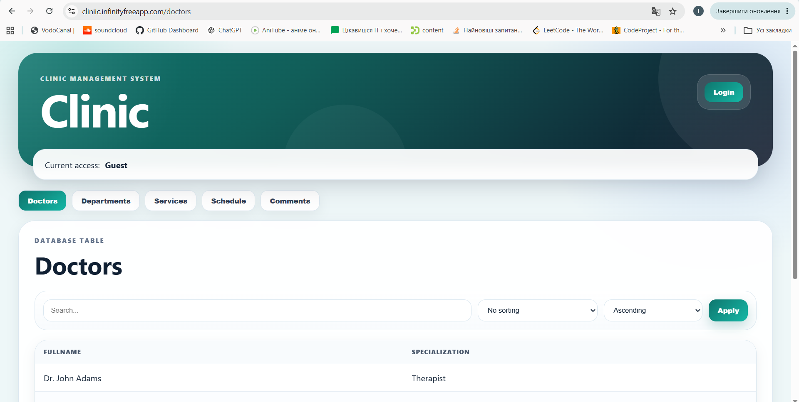

### 2. Авторизація
- **УРЛ:** `/login`
- **Опис:** Форма входу користувача в систему. Після входу зберігається JWT token.
- **Скріншот:**
  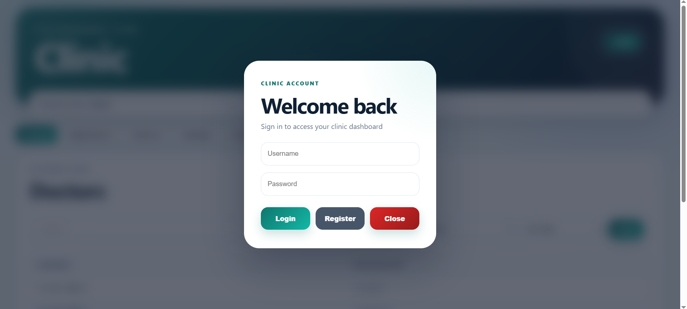

### 3. Лікарі (Doctors)
- **УРЛ:** `/doctors`
- **Опис:** Таблиця лікарів із даними про спеціалізацію, відділення та телефон.
- **Скріншот:**
  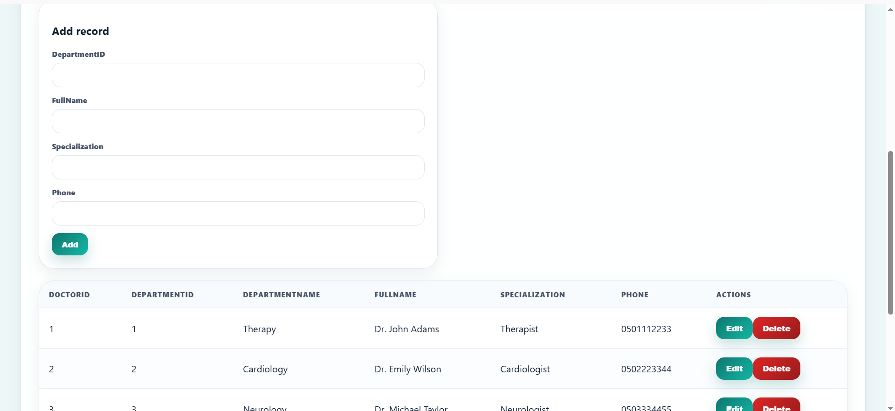

### 4. Відділення (Departments)
- **УРЛ:** `/departments`
- **Опис:** Список відділень клініки з описом.
- **Скріншот:**
  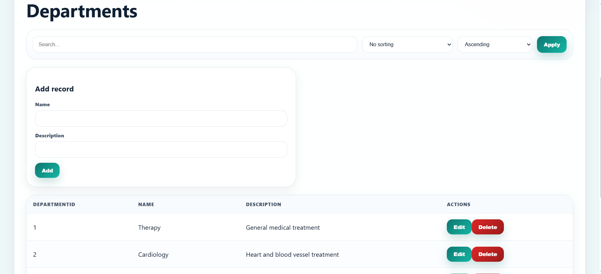

### 5. Послуги (Services)
- **УРЛ:** `/services`
- **Опис:** Перелік медичних послуг, їх вартість та тривалість.
- **Скріншот:**
  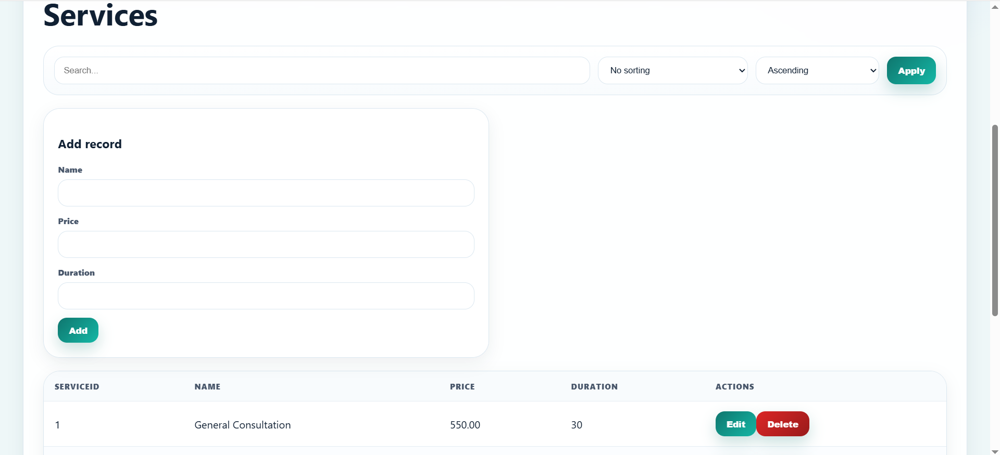

### 6. Розклад (Schedule)
- **УРЛ:** `/schedule`
- **Опис:** Розклад лікарів. Admin і Client бачать Schedule List та Weekly Calendar, Guest бачить тільки Weekly Calendar.
- **Скріншот:**
  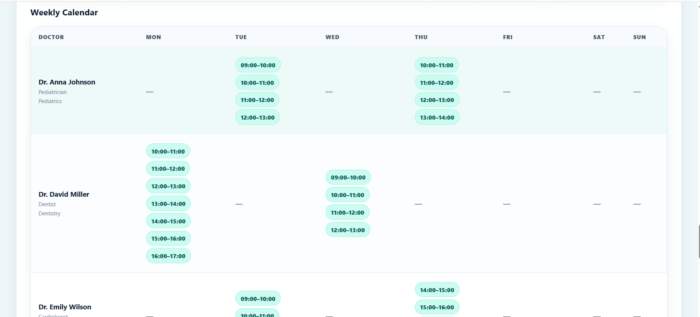

### 7. Записи на прийом (Appointments)
- **УРЛ:** `/appointments`
- **Опис:** Таблиця записів пацієнтів до лікарів із датою, статусом, послугою та причиною звернення.
- **Скріншот:**
  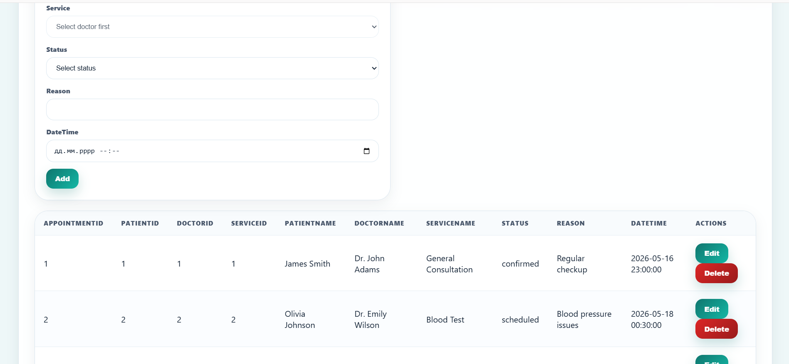

### 8. Пацієнти (Patients)
- **УРЛ:** `/patients`
- **Опис:** База даних пацієнтів. Доступна тільки адміністратору.
- **Скріншот:**
  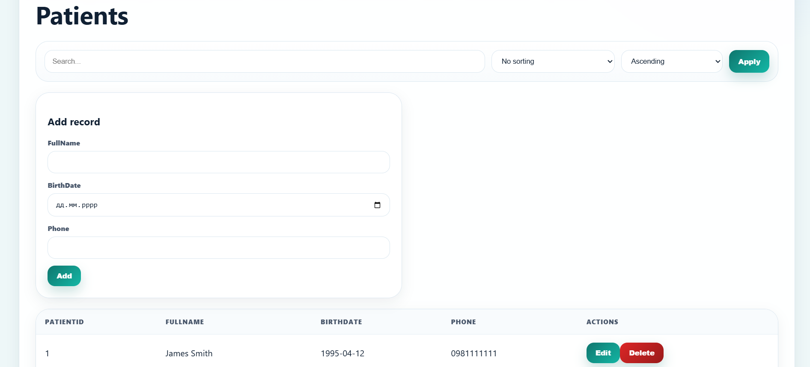

### 9. Діагнози (Diagnoses)
- **УРЛ:** `/diagnosis`
- **Опис:** Сторінка з діагнозами пацієнтів та нотатками лікаря.
- **Скріншот:**
  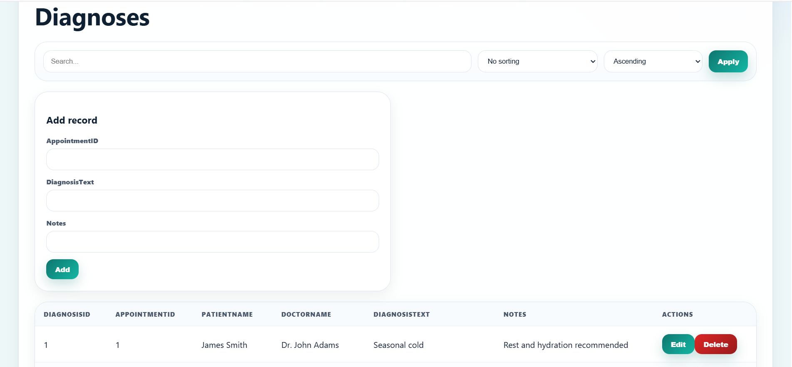

### 10. Призначення (Prescriptions)
- **УРЛ:** `/purpose`
- **Опис:** Медичні призначення: ліки, дозування та тривалість лікування.
- **Скріншот:**
  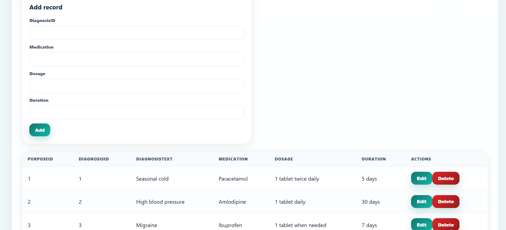

### 11. Оплати (Payments)
- **УРЛ:** `/payments`
- **Опис:** Облік оплат за медичні послуги. Доступно адміністратору.
- **Скріншот:**
  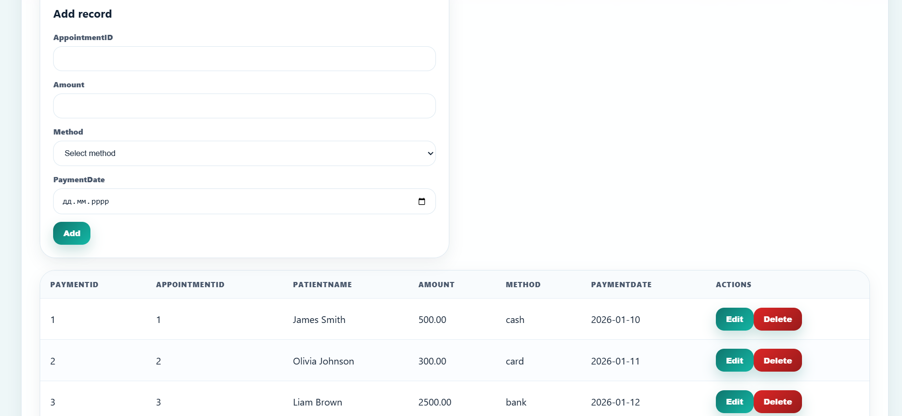

### 12. Коментарі (Comments)
- **УРЛ:** `/comments`
- **Опис:** Відгуки пацієнтів про лікарів, текст коментаря та рейтинг.
- **Скріншот:**
  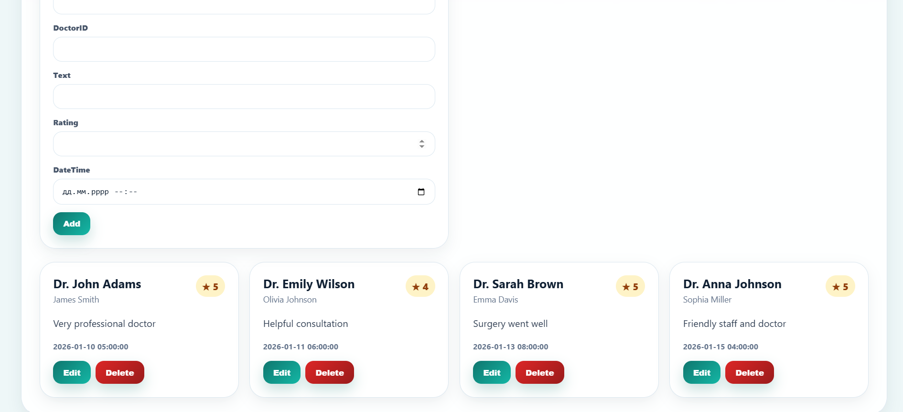

### 13. Користувачі (Users)
- **УРЛ:** `/users`
- **Опис:** Адміністративна сторінка керування користувачами та ролями.
- **Скріншот:**
  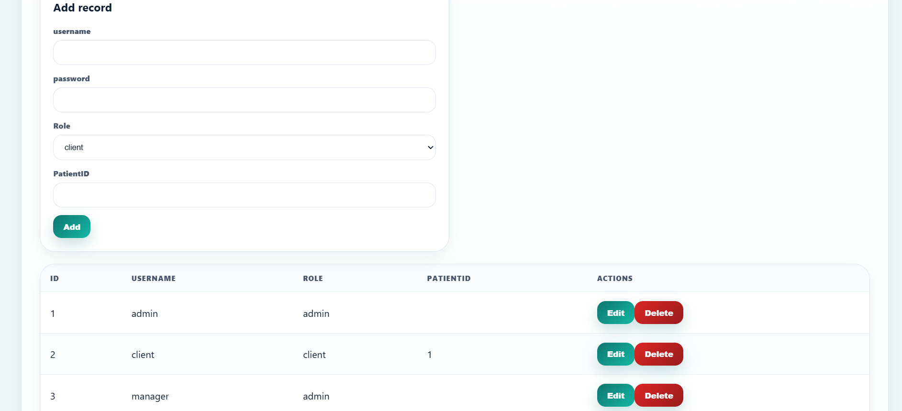

# PHP API (Backend)

Усі API ендпоінти знаходяться у файлі:

```text
/api.php
```

JWT авторизація використовується для захисту приватних API маршрутів.

---

## API Можливості

| Метод | Опис |
|---|---|
| GET | Отримання даних |
| POST | Створення записів |
| PUT | Редагування записів |
| DELETE | Видалення записів |

## Структура файлів на хостингу

```text
htdocs/
├── index.html              ← React SPA entry point
├── .htaccess               ← Rewrite rules для React Router
├── api.php                 ← PHP REST API
├── jwt.php                 ← JWT token логіка
├── assets/
│   ├── index-***.js        ← Збірка React
│   └── index-***.css
├── screenshots/
│   ├── 1.png
│   ├── 2.png
│   ├── 3.png
│   ├── ...
│   └── 13.png
├── src/
│   ├── App.jsx
│   ├── App.css
│   ├── main.jsx
│   ├── ClinicPage.jsx
│   ├── store/
│   │   └── store.js
│   └── pages/
│       ├── LoginPage.jsx
│       ├── DoctorsPage.jsx
│       ├── SchedulePage.jsx
│       └── AppointmentsPage.jsx
├── package.json            ← React dependencies
├── vite.config.js          ← Vite configuration
└── PROJECT_DOCS.md               ← Документація проекту
```
